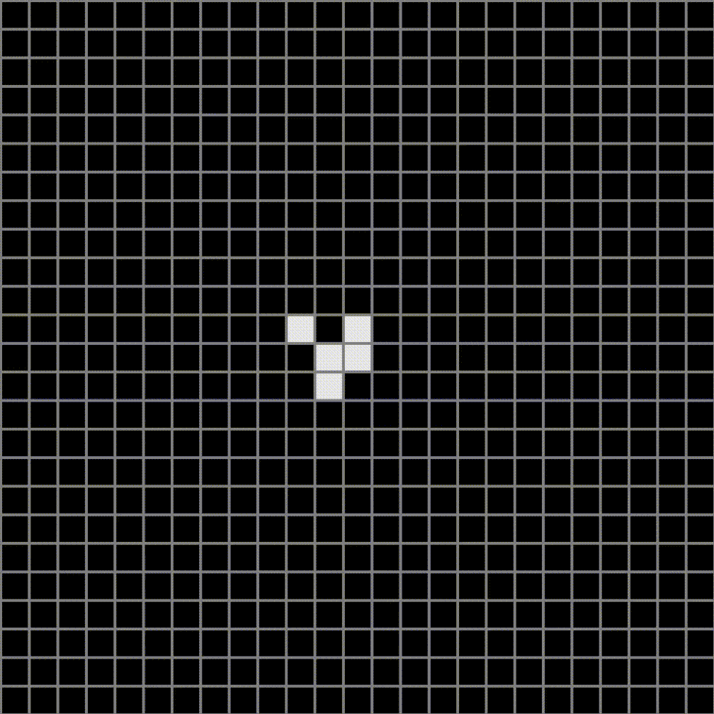

# Conways_game_of_life
As a fun little project to waste some time and continue my programming over the summer break I began this project to create a conways game of life in python using pygame.
## An example of it running can be seen below

## breaking down the code
The project was created using object oriented programming, each square on the map is of the class cell who's attributes can be seen below:
```python
def __init__(self, color, width, row, column, totalCol, totalRow, window):
        self.color = color
        self.x = row * width
        self.y = column * width
        self.width = width
        self.row = row
        self.column = column
        self.neighbors = []
        self.totalColumns = totalCol
        self.totalRows = totalRow
        self.alive = False
        self.window = window
        self.friends = []
```
Each cell is initialized as not alive and is assigned a row and column at instantiation. Each cell has two lists which hold other cells, one is called neighbors which holds all 8 cells adjecent to the cell and the other is friends which contains all of the cells neighbors which are currently alive.
Some methods of the cell class are quite simple such as :
- isAlive() - returns bool 
- makeAlive() - changes cells alive attribute to true
- makeDead() - changes cells alive attribute to false
- getX() - returns cells x position
- getY() - returns cells y position
- changeColor() - changes color of cell from white to black if dead or black to white if dead
- drawNode() - draws the cell on the window
- updateFriends() - clears the friends list after each update

### More interesting methods/functions
#### getNeighbor():
```python
def getNeighbor(self, row, column, totalRow, totalCol, list):

        if not row + 1 > totalRow:
             self.neighbors.append(list[column][row + 1])           
        if not row - 1 < 0:
             self.neighbors.append(list[column][row - 1])
        if not column + 1 > totalCol:
             self.neighbors.append(list[column+1][row])
        if not column - 1 < 0:
             self.neighbors.append(list[column-1][row])
        # diagonals -----------
        if not row + 1 > totalRow and not column + 1 > totalCol:
            self.neighbors.append(list[column + 1][row + 1])
        if not row + 1 > totalRow and not column - 1 < 0:
            self.neighbors.append(list[column-1][row+1])
        if not row - 1 < 0 and not column + 1 > totalCol:
            self.neighbors.append(list[column+1][row-1])
        if not row - 1 < 0 and not column - 1 < 0:
            self.neighbors.append(list[column-1][row-1])
```
There most likely was a cleaner way to write this but here I am manualy checking each of the surrounding cells by reference to their row and column and checking if the cell is within the map before appending to the cells neighbor list to avoid an indexError.

#### getFriends():
```python
    def getFriends(self):
        for friendCell in self.neighbors:
            if friendCell.isAlive() == True:
                if not friendCell in self.friends:
                    self.friends.append(friendCell)
```
